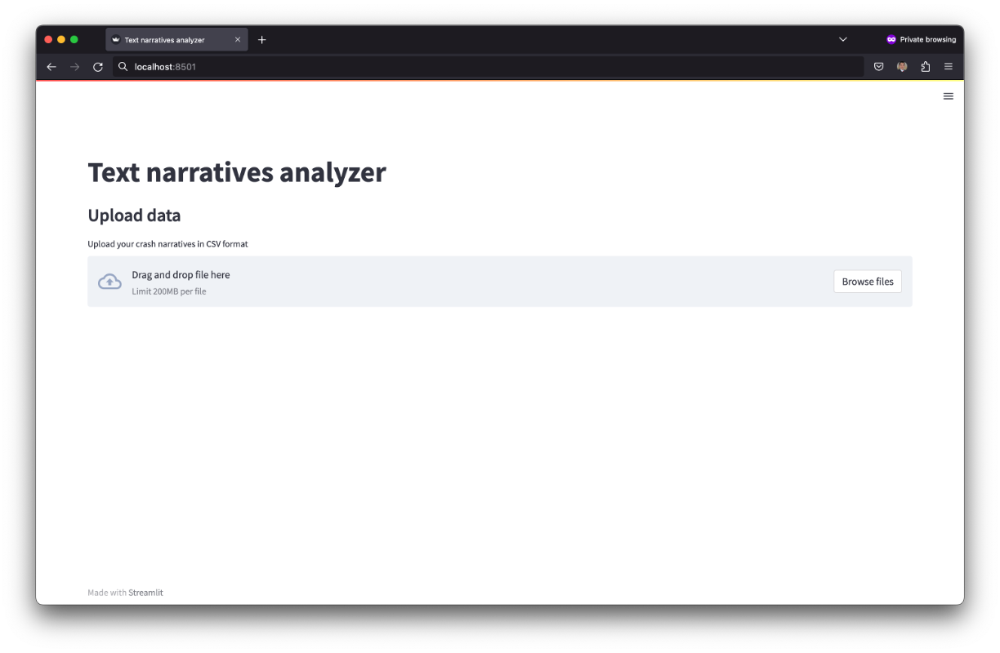

Installation
============
TNA is a web application that runs on a Python backend. It uses Streamlit for web rendering, PyTorch and HuggingFace Transformers for model training, as well as Pandas, Numpy, and Scikit-Learn for data handling. The installation steps below install all the required Python dependencies.

TNA can be installed on Windows, Linux, or Mac, as the only dependency is a functional Python environment with support for the aforementioned libraries.

Installation steps
------------------

1. Download and install `Python 3.7 or newer <https://www.python.org/downloads/>`_.
2. Download `TNA's source code <https://github.com/arteagac/tna/archive/refs/heads/main.zip>`_ and unzip the file.  
3. Open a command line and navigate to the unzipped folder.  
4. Install required packages using::

    pip install -r requirements.txt

If you are familiar with Python virtual environments, you can install TNA on a virtual environment to avoid potential versioning issues with your pre-installed libraries.

.. hint::

   TNA works faster on GPUs, as training deep learning models can be performed efficiently on these devices. To use a GPU, make sure you install PyTorch with GPU support by following `PyTorch's installation instructions <https://pytorch.org/get-started/locally/>`_. After installing PyTorch with GPU support, TNA will detect it and automatically switch to GPU processing.

Run web application
-------------------
Open a command line, navigate to the project folder, and execute::

    streamlit run web.py
    
This will open a new tab in your web browser, as illustrated in the figure below. Alternatively, you can navigate to your localhost URL at the default streamlit's port 8501.

