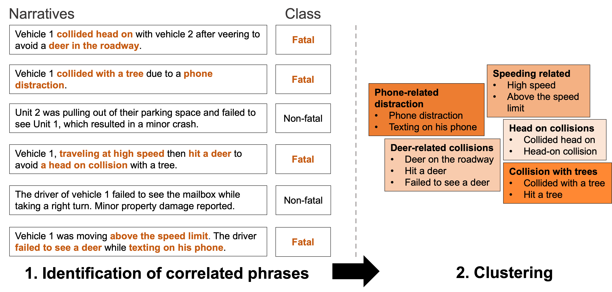

Overview
========
TNA (Text Narratives Analyzer) is an open-source tool to find potential correlations between text narratives and a target class or category. For example, TNA finds potential correlations between crash narratives and the fatal or non-fatal classification of the crashes, as illustrated in the image below. TNA works by training a text classifier to predict the target class for a given narrative (e.g., fatal) and using sliding-window and peak-detection strategy to identify phrases correlated with the target class.

TNA was initially coincived for analysis of crash narratives, but the correlation-finding approach can be applied to other data sources, as shown in the "Tutorial" section, in which a dataset of movie reviews is used for demonstration purposes. 

