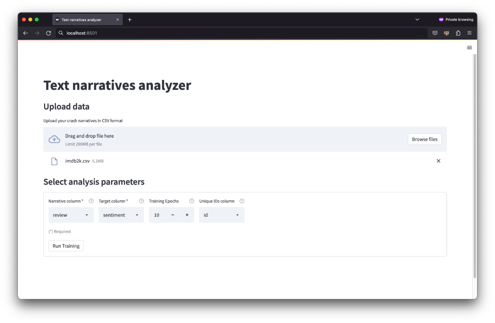
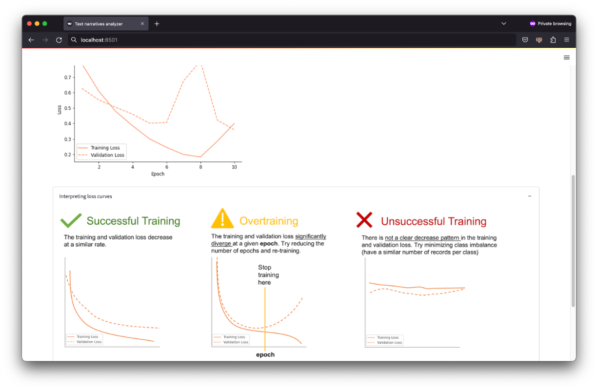
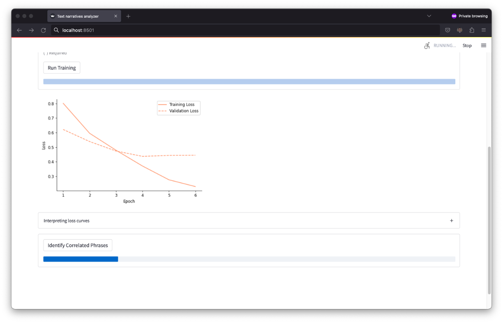
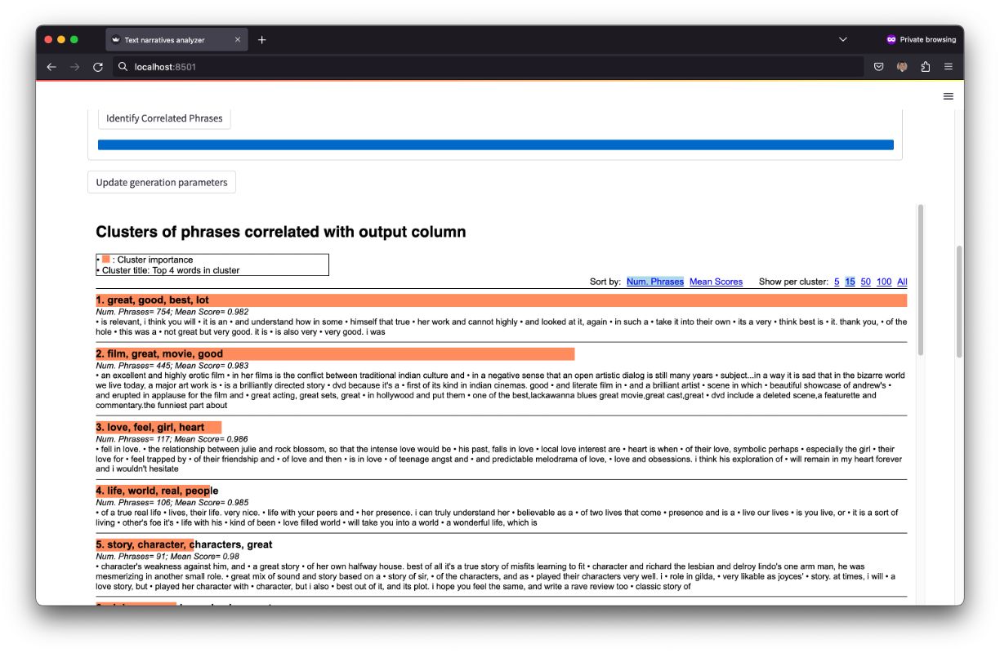

Tutorial
========

This tutorial explains how to use TNA to identify potential correlations between phrases in narratives and a target class. This tutorial uses a dataset of narratives for moview reviews whose target class is the moview sentiment (positive or negative). Therefore, TNA will identify phrases in the narratives correlated with positive moview reviews. This dataset is a smaller version of the popular IMDB movie reviews dataset. You can download the dataset from this link.

Step 1. Data loading and parameter selection
--------------------------------------------
The tool takes as input a CSV file. As illustrated in the image below, the CSV file must contain a text column (``review``) and a target column (``sentiment``) encoded in a binary format (``1`` for positive class, ``0`` for negative class). A column with unique ids (``id``) can be also provided but it is not required. The text data does not need any type of pre-processing.

To load the data, click the "Browse files" button and locate the CSV file in your local computer. After uploading the file select 1) the "Narrative column", which contains the text data and 2) the "Target column", which contains information for the target class. The system uses information in these two columns to establish correlations between the text narratives and the target class. Also, you need to set the "Number of epochs" to train the underlying text classifier that identifies correlations. You can use ``10`` epochs as set by default and change this number later as explained in the next step. Finally, you can also select the "Unique IDs column" to show in the final results the ID of the narratives from which the phrases were extracted. 

Step 2. Text classifier training
--------------------------------
After uploading the data and selecting the analysis parameters you simply need to click the "Run Training" button to train the underyling text classifier that establishes correlations between the narratives and the target column. The training may take a few seconds or several minutes depending on the computer specs (GPUs can make the training faster), the size of the dataset, and the selected number of epochs. After the training is complete, the system shows a "loss plot" and provides instructions on how to interpret this plot to determine whether the training was successful or not. In general terms, you want both the training and evaluation loss to decrease at a similar rate. Overtraining (a.k.a. overfitting) is a very common scenario, as shown in the image below, in which case you need to reduce the number of epochs and run the training again. 

Note that after reducing the number of epochs to 6 (a.k.a early stopping),  that the loss plot shows a better decreasing patter for the training and validation loss.

Step 3. Identification and clustering of correlated phrases
-----------------------------------------------------------

Finally, after the training is complete, you just need to click the "Identify phrases" button to execute the sliding-window and peak detection approaches, which extract all the phrases potentially correlated with the target column and cluster such phrases by similarity. The output of the tool is a set of clusters that group similar phrases in the narratives identified as correlated with the output column. The output includes the four most common words on each cluster, the number of phrases within the clusters, and the average correlation of the phrases within that cluster. By default the output shows 15 sample phrases, but provides an option to change the number of phrases to display (top right of the screen). 

The output shows that the tool identified phrases that describe "great film", "good movie", "great story", "great character" as correlated with positive movie reviews. To better tune the output of the system, you can click the "Update generation parameters" button, which provides options to select a higher or lower threshold for the peak detection algorithm (to define a desired correlation strength) and the number of clusters to be generated.

Analysis of quantitative data
^^^^^^^^^^^^^^^^^^^^^^^^^^^^^
For analysis of quantitative data, this project includes an open-source Python library called `xlogit <https://github.com/arteagac/xlogit>`_. This library conducts statistical-based analysis (Logit and Multinomial Logit) to identify potential causality associations between a set of factors and a desired target class. For example, for traffic safety analysis `xlogit <https://github.com/arteagac/xlogit>`_ identifies potential causality associations between crash factors and severe crashes. For instructions on how to use `xlogit <https://github.com/arteagac/xlogit>`_, please follow `xlogit's documentation and examples <https://xlogit.readthedocs.io/en/latest/notebooks/multinomial_model.html>`_.